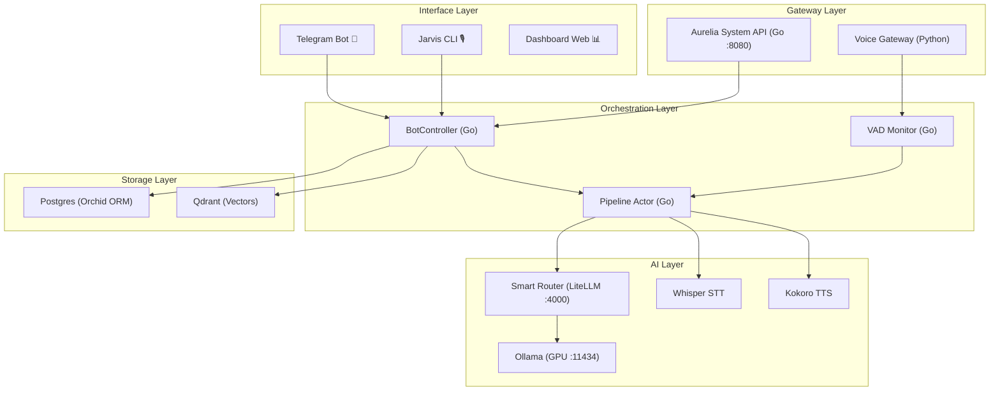

# Arquitetura do Ecossistema Aurélia

**Versão:** Sovereign 2026 Q2
**Data:** 2026-03-30

---

## Visão Geral

O `aurelia` é um monorepo de IA soberana para Ubuntu 24.04 LTS. Opera como uma **Appliance de IA** com todos os componentes críticos rodando localmente como serviços do sistema (systemd).

---

## Estrutura de Módulos

| Módulo | Linguagem | Responsabilidade |
|--------|-----------|-----------------|
| `cmd/aurelia/` | Go | Entry points: `live`, `bot`, `api` |
| `internal/streaming/` | Go | Pipeline de streaming, atores, VAD |
| `internal/audio/` | Go | Player (mpv), captura |
| `services/` | Go | BotController, handlers Telegram |
| `scripts/` | Python | Voice Gateway, captura de áudio |
| `packages/zod-schemas/` | TypeScript | Contratos de dados (Zod-First) |
| `configs/systemd/` | INI | Units de serviço para Ubuntu |

---

## Padrões de Qualidade

- **Linguagem Go**: `gofmt` obrigatório, `golangci-lint` como gate.
- **Python**: `ruff` + `mypy` para tipo seguro.
- **TypeScript**: `eslint` + `prettier` com config no `.editorconfig`.
- **Secrets**: Zero hardcode. `EnvironmentFile` via `.env` (nunca comitado).
- **Testes**: Unitários por módulo, smoke test E2E via `scripts/`.

---

## Referências

- [CONSTITUTION.md](../CONSTITUTION.md)
- [docs/adr/README.md](docs/adr/README.md)
- [configs/systemd/](configs/systemd/)
