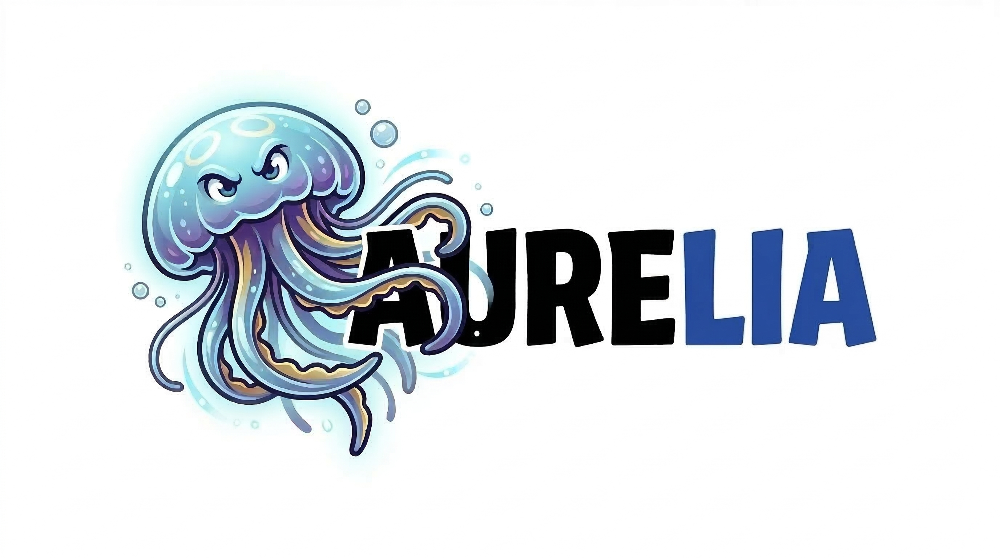

<div align="center">

# Aurelia (Elite Edition)



**A local-first autonomous coding agent in Go.**

---

[](https://go.dev/)
[](#runtime-model)
[](docs/ARCHITECTURE.md)
[](#why-aurelia)
[](#🤖-2-orquestração-e-comandos)

</div>

## 🏛️ Multi-Agent Workspace (Elite Edition)
> O template definitivo para **Google Antigravity** + **Claude Code** + **Codex**. 
> Orquestração disciplinada, segurança total e alta performance.

---

## 🚀 1. Diferenciais Competitivos
Este template supera referências mundiais ao integrar o melhor de cada ecossistema:
- **BMAD Orchestration**: Fluxo rigoroso PRD ➡️ Architect ➡️ Dev ➡️ QA.
- **Multi-Runtime**: Pronto para inter-operar com Claude, Codex e Gemini.
- **Global Intelligence**: Subagentes e skills injetados via `ag-init`.
- **Anti-Hallucination**: Regras de autoridade única e relatórios baseados em diff.

## 🤖 2. Orquestração e Comandos
Invoque especialistas diretamente no seu terminal ou IDE:

<commands>
- `/pm` ➡️ Requisitos e Critérios de Aceite.
- `/architect` ➡️ Tech Specs e Design de Sistemas.
- `/dev` ➡️ Implementação e Correções Ágeis.
- `/qa` ➡️ Testes, Validação e Auditoria.
- `/adr-semparar` ➡️ Abre uma slice longa com ADR + JSON de continuidade estilo taskmaster.
- `/sincronizar-ai-context` ➡️ Sincroniza `.context/` e regenera o `codebase-map`.
- `/sincronizar-tudo` ➡️ Commit semântico e Push Sênior.
- `/pesquisa-profunda` ➡️ Pesquisa profunda via Gemini Web.
</commands>

## 📜 2.1 Contrato do Repositório

Antes de executar qualquer slice não trivial, leia nesta ordem:

1. `AGENTS.md`
2. `CLAUDE.md`, `CODEX.md`, `GEMINI.md`, `MODEL.md`
3. `docs/REPOSITORY_CONTRACT.md`
4. `docs/adr/README.md`
5. `plan.md`

## 🔧 2.2 ADRs Críticas em Andamento (Governança Industrial)

| ADR | Status | Fases | Executor | Comando |
|---|---|---|---|---|
| [ADR-20260319-Polish-Governance-All](./docs/adr/ADR-20260319-Polish-Governance-All.md) | 🟡 Proposto | 4 (CRITICAL → HIGH → MEDIUM → LOW) | humano + codex | `/governance-polish` |

**Fase 1 (CRITICAL — Humano):** Criar vault KeePassXC em `/srv/data/vault/aurelia.kdbx`, migrar credenciais, shred plaintext, fix postgres password.
**Fases 2-4 (Codex):** Scripts, esquemas, audits, compliance. Usar `/governance-polish --phase 2` (após Fase 1).

Regras fechadas:

- mudança estrutural exige ADR
- slice longa pode usar `/adr-semparar`
- `sync-ai-context` é obrigatório em slice não trivial, handoff e merge
- `main` não recebe commit direto
- worktree isolada é o padrão para implementação relevante

## 📁 3. Estratégia de Pastas
- **`docs/`**: Verdade arquitetural, ADRs e benchmarks.
- **`.agents/`**: Governança local (Rules, Workflows).
- **`.context/`**: Memória de trabalho e estado (Gerido via MCP).
- **`.context/plans/`**: Planos e task boards de slices em andamento ou encerradas.
- **`internal/` / `pkg/`**: Implementação Core em Go.
- **Raiz**: Apenas contratos, docs de entrada, exemplos globais e o `plan.md`.

---

## 🏗️ Visão Geral Técnica (Aurelia Core)

O `Aurelia` é um agente de codificação autônomo projetado para rodar localmente com disciplina operacional explícita e alta confiabilidade.

### 🛡️ Runtime de Produção
- **Supervisor Oficial**: Gerenciado via `systemd --user` (Independente de root).
- **Lock de Instância Única**: Mecanismo robusto via `flock` em `~/.aurelia/instance.lock` (Evita duplicidade e corrupção).
- **Observabilidade**: Logging estruturado com `log/slog`. Logs unificados em `~/.aurelia/logs/daemon.log`.
- **Configuração**: Gerida centralmente em `~/.aurelia/config/app.json`.

### ⚡ Performance & Pegada
- **Tamanho do Binário**: ~`23 MB` (Go estático).
- **Consumo em Idle**: ~`25 MB` RAM.
- **Startup Latency**: < `20 ms`.

### ⚙️ Setup Operacional
Requisitos: Go `1.25+`, Token do Telegram, API Key de LLM.

```bash
# 1. Onboarding e configuração inicial
go run ./cmd/aurelia onboard

# 2. Build do binário de produção
./scripts/build.sh

# 3. Instalar e ativar o Daemon de usuário
./scripts/install-user-daemon.sh

# 4. Monitoramento operacional
./scripts/daemon-status.sh
./scripts/daemon-logs.sh
```

### 🌿 Convenção de Versionamento Local

- Branches: `feat/`, `fix/`, `research/`
- Worktrees: use diretórios isolados por objetivo, por exemplo:
  - `/home/will/aurelia`
  - `/home/will/aurelia-24x7`
  - `/home/will/aurelia-main-merge`

Para slices longas:

```bash
./scripts/adr-slice-init.sh <slug> --title "Title"
```

Isso gera:

- `docs/adr/ADR-YYYYMMDD-slug.md`
- `docs/adr/taskmaster/ADR-YYYYMMDD-slug.json`

### 🛠️ Modo de Debug (Manual)
Use `./aurelia-elite` em foreground apenas para testes. Recomenda-se parar o daemon antes:
```bash
systemctl --user stop aurelia.service
```
Se uma instância já estiver ativa, o runtime falhará com erro claro e diagnóstico (PID, Comando, Timestamp).

---
*Este repositório foi construído para ser o #1 do GitHub em orquestração multi-agente.* 🚀
