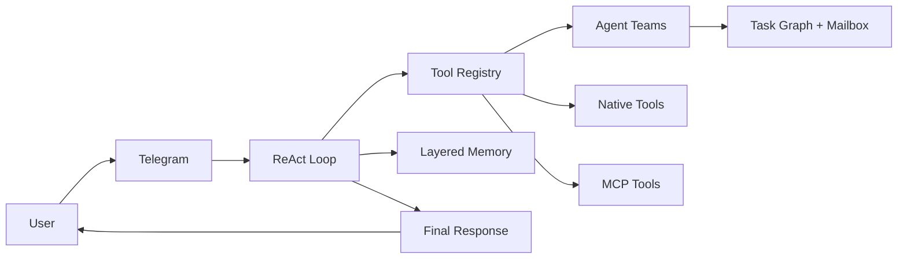

<div align="center">

# Aurelia

**A local-first autonomous coding agent in Go.**

Telegram-native. Tool-driven. SQLite-backed. Built to stay light.

One persistent agent, many target projects.

[](https://go.dev/)
[](#runtime-model)
[](docs/ARCHITECTURE.md)
[](#why-aurelia)
[](https://sqlite.org/)
[](https://core.telegram.org/bots/api)
[](https://modelcontextprotocol.io/)
[](#lightweight-baseline)
[](#lightweight-baseline)

</div>

## Why Aurelia

`Aurelia` is an autonomous coding agent designed to run locally with a small operational footprint and explicit runtime behavior.

It is built around a practical execution model:

- Go runtime
- SQLite persistence
- tool-driven ReAct loop
- master-led Agent Teams
- deterministic layered memory
- controlled local command execution
- optional MCP expansion

The goal is not to fake autonomy through giant prompts.
The goal is to observe the local environment, act with real tools, persist useful state, and remain understandable under load.

## Lightweight Baseline

Current measured baseline is documented in [docs/BENCHMARKS.md](docs/BENCHMARKS.md).

Release build:

- binary size: `23.22 MB`

Idle runtime baseline on the current Windows machine:

- startup average: `15.75 ms`
- idle working set: `25.66 MB`
- idle private memory: `53.39 MB`
- idle CPU average: `0.00%`

Method summary:

- release build with `-trimpath -ldflags "-s -w"`
- isolated `AURELIA_HOME`
- temporary DB and MCP config paths
- three-run sample

These numbers are local baseline measurements, not universal guarantees across all hardware.

## Core Capabilities

- Telegram-native interaction with text, markdown documents, and audio input
- tool-driven ReAct execution
- Agent Teams with master-only user response, task graph, mailbox, and recovery
- SQLite-backed recent memory, facts, notes, archive, and operational task state
- local file operations and controlled command execution
- project-aware `workdir` propagation
- cron scheduling subsystem
- optional MCP tool discovery and registration

## Runtime Model

Aurelia separates three scopes:

1. Repository
2. Local instance
3. Target project

This keeps product source, user runtime state, and external project work clearly separated.

High-level flow:



## Architecture

Aurelia follows a modular monolith layout:

```text
/cmd/aurelia/
  main.go
  app.go
  wiring.go

/internal/
  agent/
  config/
  cron/
  mcp/
  memory/
  persona/
  runtime/
  skill/
  telegram/
  tools/

/pkg/
  llm/
  stt/
```

Architectural source of truth:

- [docs/ARCHITECTURE.md](docs/ARCHITECTURE.md)

Implementation rules:

- [docs/STYLE_GUIDE.md](docs/STYLE_GUIDE.md)

Operational lessons:

- [docs/LEARNINGS.md](docs/LEARNINGS.md)

## Setup

Requirements:

- Go `1.25+`
- Telegram bot token
- Kimi API key
- Groq API key for STT

Example environment:

```env
TELEGRAM_BOT_TOKEN=your-telegram-bot-token
TELEGRAM_ALLOWED_USER_IDS=123456789
KIMI_API_KEY=your-kimi-api-key
GROQ_API_KEY=your-groq-api-key
MAX_ITERATIONS=5
DB_PATH=./data/aurelia.db
MEMORY_WINDOW_SIZE=20
MCP_SERVERS_CONFIG_PATH=./mcp_servers.example.json
```

Run:

```bash
go run ./cmd/aurelia
```

Release build:

```bash
go build -trimpath -ldflags "-s -w" -o ./build/aurelia.exe ./cmd/aurelia
```

## Documentation

Canonical documents for ongoing work:

- [AGENTS.md](AGENTS.md)
- [docs/ARCHITECTURE.md](docs/ARCHITECTURE.md)
- [docs/STYLE_GUIDE.md](docs/STYLE_GUIDE.md)
- [docs/LEARNINGS.md](docs/LEARNINGS.md)
- [docs/BENCHMARKS.md](docs/BENCHMARKS.md)

Recommended reading order:

1. `README.md`
2. `AGENTS.md`
3. `docs/ARCHITECTURE.md`
4. `docs/STYLE_GUIDE.md`
5. `docs/LEARNINGS.md`
6. `docs/BENCHMARKS.md`

## Current State

- the active codebase runs under the `Aurelia` identity
- the repository has benchmark-backed footprint data
- the Go test suite is green
- contribution policy and CI workflows are present in the repository
