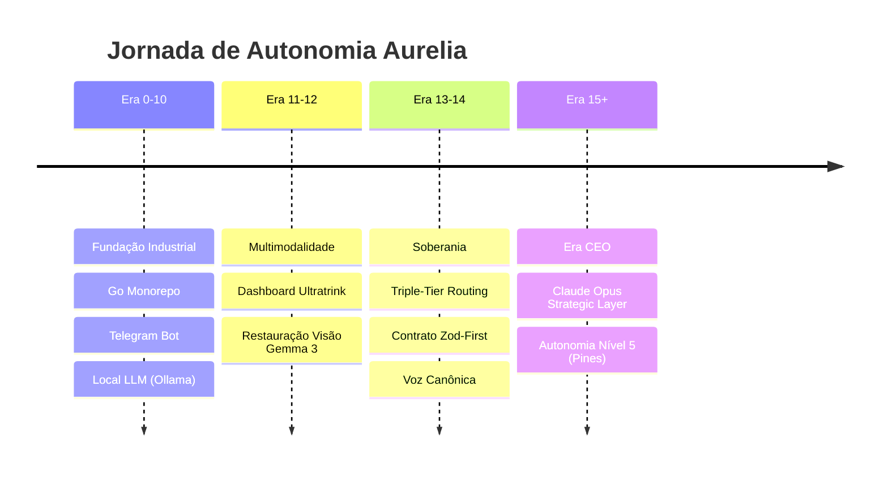

# ADR-historico: Trajetória Arquitetural Aurelia (Era 0-14) 🛰️

**Status:** ✅ Concluído e Estabilizado
**Última Atualização:** 23 de Março de 2026
**Autoridade:** Aurélia (Arquiteta Principal) / Antigravity (Coordenação)

---

## 1. Visão Geral da Evolução

Este documento é a fonte única de verdade sobre todas as decisões arquiteturais e implementações realizadas desde a fundação do monorepo até a estabilização do **Pines Core (Autonomia Nível 5)**.

## 2. Eras de Desenvolvimento

### Fundações (Era 0-10)
- **Go Monorepo**: Decisão por uma estrutura escalável e tipada.
- **Telegram Interface**: Bot como cockpit principal de comando e controle.
- **Local-First AI**: Priorização do Ollama (Gemma 3) para processamento soberano na RTX 4090.
- **Docker/CapRover**: Infraestrutura de deploy simplificada e resiliente.

### Expansão e Visão (Era 11-12)
- **ULTRATRINK Dashboard**: Interface web em React para observabilidade via SSE.
- **Unified Vision Interface**: Restauração da capacidade multimodal (OCR e Análise de Imagem) via Gemma 3.

### Governança e Autonomia (Era 13-14)
- **Triple-Tier Routing**: Roteamento dinâmico entre MiniMax (Premium), DeepSeek (Estruturado) e Gemma 3 (Local).
- **Zod-First Schema**: Centralização de contratos em `packages/zod-schemas/`.
- **Voz Canônica**: Identidade auditiva formal e doce integrada via Kokoro-TTS local.

---

## 🧪 Relatório Técnico: MVP Implementação Completa (Março 2026)

### Fase 0: Git Hygiene & TTS
- Pruning de XTTS e adoção do **Kokoro PT-BR** como motor de voz oficial.
- Limpeza de artefatos e atualização de `.gitignore`.

### Fase 1: Agent Loop & Runtime Guidance
- Implementação do filtro `allowedTools` no Agent Loop.
- Injeção de `Runtime Capabilities` no prompt do sistema para evitar alucinações sobre ferramentas.

### Fase 2: Squad Dinâmico
- Registro automático de agentes ativos no dashboard.
- Tracking de ciclo de vida (`online`, `busy`, `offline`) integrado ao MasterTeamService.

### Fase 3: Dashboard & Gateway SSE
- Publicação de decisões de roteamento em tempo real via Server-Sent Events (SSE).
- Endpoint `/api/router/status` expondo métricas de latência e saúde dos provedores.

### 🐛 Bônus: Falsos Positivos Corrigidos
- Implementada lógica de "Partial Response" no pipeline do Telegram. O bot agora entrega respostas úteis mesmo em caso de erro parcial de provedores de nuvem.

---

## 📋 Checklist Consolidado (Proof of Work)

- [x] **S0-S5 (Foundations)**: Git, Docker, Go, Telegram, Memory (Qdrant), Skills.
- [x] **S6-S10 (Infrastructure)**: Vision (Gemma 3), Structured Logging, Dashboard (SSE), Security (Sudo=1).
- [x] **S11-S14 (Intelligence)**: Symbol Map (AST), Triple-Tier Routing, Autonomous Planning, Voice Identity.
- [x] **S15-S21 (Modernização)**: Claude Opus CEO, Codex Purge, Poda Industrial, Unificação .agents/.claude.

---
## 🛰️ Registro de Poda Industrial (24 de Março de 2026)
- **Motivo**: Eliminação de dívida técnica do motor Codex (OpenAI Antigo) e unificação de ambientes multi-motor.
- **Ações**:
    - Purga completa de `OpenAIAuthMode` no core Go.
    - Remoção de logs de stress-test e binários órfãos na raiz.
    - Unificação de diretórios de skills: `.claude` agora é espelho de `.agents`.
    - Limpeza de 47MB de recursos Docker órfãos.

## 📚 Unificação Sovereign-Bibliotheca v2 (25 de Março de 2026)
- **Motivo**: Fragmentação de ferramentas entre Go/Node/Bash e alto volume de artefatos externos degradando performance.
- **Ações**:
    - Criação da `homelab-bibliotheca/lib/` (Bash Unified Layer).
    - Implementação de módulos agnósticos de Memória, Notas, Comms e Skills.
    - Cleanup massivo do Git: **2.4GB** de competências externas removidos do rastreamento (.gitignore industrial).
    - Instituição da **Regra de Governança 15** para manutenção da ordem técnica.
    - Sincronização e regeneração do `codebase-map.json` via ai-context.
