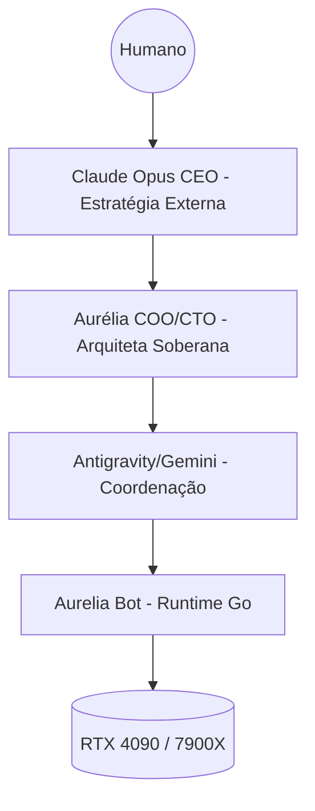

# ADR: Roadmap de Evolução e Slices Pendentes 🎯

**Status:** 🔄 Ativo (Ponto de Referência para Novas Slices)
**Autoridade:** Aurélia (Arquiteta Principal)
**Foco:** Autonomia Total e Cognição Local-First

---

## 1. Objetivos Estratégicos (Jarvis 2026)

A Aurelia deve transicionar do estado de assistente para um sistema de engenharia autônomo, onde a intervenção humana seja reduzida a < 5%. A cognição deve ser priorizada no hardware local (RTX 4090 + 7900X).

## 2. Backlog de Slices (Status Oficial)

| ID | Slice Name | Descrição | Status | Prioridade |
|:---|:---|:---|:---:|:---:|
| **S-15** | Tool Introspection | Filtro semântico dinâmico de ferramentas via Qdrant. | 📅 Pendente | ALTA |
| **S-16** | Execution DNA | Templates de workflow nativos (Go) por tipo de tarefa. | 📅 Pendente | MÉDIA |
| **S-17** | Planning Loop | Loop PREV (Plan-Review-Exec-Verify) nativo no daemon. | 📅 Pendente | CRÍTICA |
| **S-18** | Symbol Map (Real) | Parseamento AST nativo (.ast) para localização de símbolos. | 📅 Pendente | ALTA |
| **S-20** | CEO Governance | Camada estratégica Claude Opus p/ decisões de alto impacto. | ✅ Concluído | CRÍTICA |
| **S-21** | Poda Industrial | Limpeza de logs, binários órfãos e recursos Docker (Codex Purge). | ✅ Concluído | MÉDIA |

## 3. Detalhamento dos Próximos Passos (Curto Prazo)

### S-17: Planning Loop (Caminho Crítico)
- Mover a lógica de orquestração do Antigravity/Aurélia para dentro do binário `aurelia` em Go.
- Implementação do `gatekeeper` de segurança para planos que afetam infraestrutura (sudo).

### S-18: Codebase Symbol Map
- Substituição do grep puro por busca consciente de símbolos via Go Parser.
- Sincronização automática com metadados do Qdrant.

## 4. Visão de Longo Prazo (S20+)
- **Autonomous HW Management**: Gestão dinâmica de VRAM e eficiência energética via `nvidia-smi`.
- **Cognitive Self-Healing**: Aurélia auto-corrigindo falhas de containers via PRs internos baseados em logs.
- **Global Auth Proxy**: Identidade unificada via Dashboard, Bot e CLI.

---

## 🚀 Próximas Implementações UI (Dashboard)
- [ ] **RouterStatus.tsx**: Visualização gráfica do orçamento e latência de Tiers.
- [ ] **SquadLoadMap**: Mapa de calor da carga de trabalho dos agentes.
- [ ] **Live Logs Visualizer**: Filtro semântico de logs estruturados em tempo real.

---
*Referência obrigatória para o início de toda nova tarefa no ecossistema Aurélia.*
