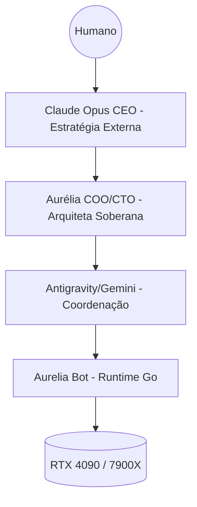

# ADR: Roadmap de Evolução e Slices Pendentes 🎯

**Status:** 🔄 Ativo (Ponto de Referência para Novas Slices)
**Autoridade:** Aurélia (Arquiteta Principal)
**Foco:** Autonomia Total e Cognição Local-First

---

## 0. Políticas Imutáveis (ler antes de qualquer slice)

| Política | Arquivo | Regra |
|----------|---------|-------|
| **Model Stack** | [`docs/governance/MODEL-STACK-POLICY.md`](./governance/MODEL-STACK-POLICY.md) | Stack canônico: gemma3:12b local + OpenRouter cloud. Nenhum modelo proibido pode ser reintroduzido. |
| **Rede/Portas** | [`docs/governance/S-23-cloudflare-access.md`](./governance/S-23-cloudflare-access.md) | Subdomínios via Terraform + rule 12 |

> **Agentes:** Leia as políticas acima ANTES de sugerir ou alterar qualquer modelo, porta ou subdomínio.

---

## 1. Objetivos Estratégicos (Jarvis 2026)

A Aurelia deve transicionar do estado de assistente para um sistema de engenharia autônomo, onde a intervenção humana seja reduzida a < 5%. A cognição deve ser priorizada no hardware local (RTX 4090 + 7900X).

## 2. Backlog de Slices (Status Oficial)

| ID | Slice Name | Descrição | Status | Prioridade |
|:---|:---|:---|:---:|:---:|
| **S-15** | Tool Introspection | Filtro semântico dinâmico de ferramentas via Qdrant. | 📅 Pendente | ALTA |
| **S-16** | Execution DNA | Templates de workflow nativos (Go) por tipo de tarefa. | 📅 Pendente | MÉDIA |
| **S-17** | Planning Loop | Loop PREV (Plan-Review-Exec-Verify) nativo no daemon. | 📅 Pendente | CRÍTICA |
| **S-18** | Symbol Map (Real) | Parseamento AST nativo (.ast) para localização de símbolos. | 📅 Pendente | ALTA |
| **S-20** | CEO Governance | Camada estratégica Claude Opus p/ decisões de alto impacto. | ✅ Concluído | CRÍTICA |
| **S-21** | Poda Industrial | Limpeza de logs, binários órfãos e recursos Docker (Codex Purge). | ✅ Concluído | MÉDIA |
| **S-22** | Squad Live Load | Carga real dos agentes: CPU/jobs ativos → UpdateSquadAgentStatus automático. | 📅 Aprovado | ALTA |
| **S-23** | Dashboard Auth | Cloudflare Access Zero Trust (email allowlist) em aurelia.zappro.site. | 📅 Aprovado | ALTA |
| **S-24** | Sentinel→Squad | Health check Ollama/Gemma e OpenRouter refletindo status real no squad. | 📅 Aprovado | ALTA |
| **S-25** | Team Radio Real | Eventos reais (crons, Sentinel, falhas) publicados via dashboard.Publish → chat. | 📅 Aprovado | MÉDIA |
| **S-26** | The Brain (Qdrant) | Busca semântica de memórias e ADRs via Qdrant local na aba "The Brain". | 📅 Aprovado | ESTRATÉGICA |
| **S-27** | Telegram /status | Comando `/status` retornando squad, crons pendentes e uptime no chat. | 📅 Aprovado | MÉDIA |
| **S-28** | VRV Auto-Refresh | Botão de refresh manual para o iframe VRV no dashboard (substituir meta-refresh). | 📅 Aprovado | BAIXA |
| **S-29** | Tavily Web Search | Substituição do DuckDuckGo pela API Tavily no daemon e Claude Code. | ✅ Concluído (ADR) | ALTA |

## 3. Detalhamento dos Próximos Passos (Curto Prazo)

### S-22: Squad Live Load ⚡ [APROVADO 2026-03-24]
- `internal/agent/squad.go`: goroutine periódica (ticker 10s) chamando `UpdateSquadAgentStatus`
- Fontes de dados: `runtime.NumGoroutine()` para Aurélia, contagem de jobs ativos do CronScheduler para Cronus, probe HTTP `localhost:11434/api/tags` para Gemma, probe `openrouter.ai/api/v1/auth/key` para OpenRouter, métricas Prometheus para Sentinel
- Expor endpoint `/api/squad/load` para push manual se necessário

### S-23: Dashboard Auth 🔒 [APROVADO 2026-03-24]
- Criar Cloudflare Access Application para `aurelia.zappro.site`
- Email allowlist: apenas `will@*` autorizado
- Zero mudança no código Go — 100% no painel Cloudflare Zero Trust
- Avaliar exceção para `/api/events` (SSE pode precisar de bypass por token)

### S-24: Sentinel→Squad 🩺 [APROVADO 2026-03-24]
- Probe Ollama: `GET localhost:11434/api/tags` → se 200 e modelo presente → `online`, senão → `offline`
- Probe OpenRouter: `GET openrouter.ai/api/v1/auth/key` com bearer → latência < 2s → `online`
- Integrar ao loop de health checks existente em `cmd/aurelia/health_checks.go`
- Chamar `agent.UpdateSquadAgentStatus(id, status, load)` após cada probe

### S-25: Team Radio Real 📡 [APROVADO 2026-03-24]
- Publicar `dashboard.Publish(Event{Type:"agent_comms", ...})` em pontos-chave:
  - Cron job concluído/falhado (em `internal/cron/service.go`)
  - Sentinel detecta container down (em health_checks)
  - Handoff entre agentes (`internal/agent/loop.go`)
- `AgentComms.tsx`: tratar `type:"agent_comms"` como mensagem real (prioridade sobre banter)

### S-26: The Brain (Qdrant) 🧠 [APROVADO 2026-03-24] — ESTRATÉGICA
- Aba "The Brain" hoje é placeholder (S-18 parcial)
- Backend: endpoint `/api/brain/search?q=` → consulta Qdrant collection `aurelia-memory`
- Backend: endpoint `/api/brain/recent` → últimos 20 vetores indexados
- Frontend: input de busca semântica + cards de resultado com score de similaridade
- Indexar: ADRs, mensagens do Telegram, outputs de ferramentas, logs de crons

### S-27: Telegram /status 📲 [APROVADO 2026-03-24]
- Handler `/status` em `internal/telegram/`: montar resposta com squad atual + crons próximos + uptime
- Chamar `agent.GetFixedSquad()` + `cronStore.List()` + `time.Since(startTime)`
- Formato: mensagem Markdown com emojis de status por agente

### S-28: VRV Auto-Refresh 🔄 [APROVADO 2026-03-24]
- Botão `[↺ atualizar]` no header da aba Homelab
- `iframeRef.current.src = iframeRef.current.src` força reload
- Remove dependência do `meta http-equiv="refresh"` do VRV

### S-29: Tavily Web Search 🔎 [CONCLUÍDO 2026-03-24]
- Ref: [`docs/adr/20260324-install-tavily-web-search.md`](./adr/20260324-install-tavily-web-search.md)
- Integração de API oficial via Tavily para o daemon e configuração de MCP para o Claude Code.
- Chave de API persistida em `secrets.env`.

### S-17: Planning Loop (Caminho Crítico)
- Mover a lógica de orquestração do Antigravity/Aurélia para dentro do binário `aurelia` em Go.
- Implementação do `gatekeeper` de segurança para planos que afetam infraestrutura (sudo).

### S-18: Codebase Symbol Map
- Substituição do grep puro por busca consciente de símbolos via Go Parser.
- Sincronização automática com metadados do Qdrant.

## 4. Visão de Longo Prazo (S20+)
- **Autonomous HW Management**: Gestão dinâmica de VRAM e eficiência energética via `nvidia-smi`.
- **Cognitive Self-Healing**: Aurélia auto-corrigindo falhas de containers via PRs internos baseados em logs.
- **Global Auth Proxy**: Identidade unificada via Dashboard, Bot e CLI.

---

## 🚀 Próximas Implementações UI (Dashboard)
- [ ] **RouterStatus.tsx**: Visualização gráfica do orçamento e latência de Tiers.
- [ ] **SquadLoadMap**: Mapa de calor da carga de trabalho dos agentes.
- [ ] **Live Logs Visualizer**: Filtro semântico de logs estruturados em tempo real.
- [x] **S-22 Squad Live Load**: Barras de carga com dados reais (CPU, jobs, probe HTTP). ✅ 2026-03-24
- [x] **S-26 Brain Search**: Input semântico + cards Qdrant na aba The Brain. ✅ 2026-03-24

---
*Referência obrigatória para o início de toda nova tarefa no ecossistema Aurélia.*
