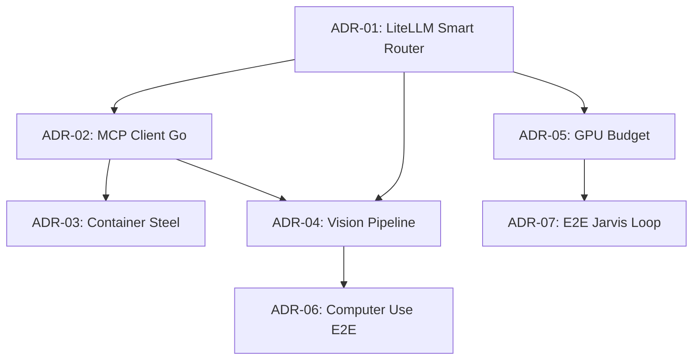

# ADR 20260328: Mapa de Dependências e Implementação - Jarvis/Computer Use

## Status
📋 Tracking (Meta-ADR)

## Contexto
Este ADR serve como mapa central de todas as peças necessárias para completar o **Protocolo Jarvis** (Voice Loop + Computer Use) com gemma3 27b + Kokoro + LiteLLM. Este documento tracking depende de 6 outros ADRs.

## Mapa de Dependências

```
┌─────────────────────────────────────────────────────────────────────────┐
│                    PRIORIDADE 1 (Crítico)                              │
├─────────────────────────────────────────────────────────────────────────┤
│                                                                         │
│  ADR-01: Smart Router LiteLLM (configs/litellm/config.yaml)           │
│  ├── dependency: Environment vars (LITELLM_MASTER_KEY, OPENROUTER_KEY) │
│  └── provides: gemma3:27b como "aurelia-smart" no tier 0             │
│                           │                                            │
│                           ▼                                            │
│  ADR-02: MCP Client Go para Stagehand                                  │
│  ├── depends: ADR-01 (precisa do gateway funcionando)                 │
│  ├── depends: mcp-servers/stagehand/src/index.ts (existe)             │
│  └── provides: mcp__stagehand__navigate/act/extract em Go             │
│                           │                                            │
│                           ▼                                            │
│  ADR-03: Container Steel (Browser Isolation)                           │
│  ├── depends: ADR-02 (Stagehand precisa do container)                 │
│  └── provides: Container isolado para Chromium/Playwright              │
│                                                                         │
└─────────────────────────────────────────────────────────────────────────┘

┌─────────────────────────────────────────────────────────────────────────┐
│                    PRIORIDADE 2 (Qualidade)                            │
├─────────────────────────────────────────────────────────────────────────┤
│                                                                         │
│  ADR-04: Vision Pipeline (Screenshot → LLM)                            │
│  ├── depends: ADR-01 (precisa do gateway)                             │
│  ├── depends: ADR-02 (precisa do MCP client)                          │
│  ├── depends: Ollama llava ou OpenRouter VL model                     │
│  └── provides: computer_vision tool + screen state tracking            │
│                           │                                            │
│                           ▼                                            │
│  ADR-05: GPU Budget (Whisper Medium + Groq STT)                       │
│  ├── depends: Groq API key                                             │
│  └── provides: STT que não estoura VRAM                               │
│                           │                                            │
│                           ▼                                            │
│  ADR-06: Computer Use E2E Agent Loop                                  │
│  ├── depends: ADR-01, ADR-02, ADR-04                                  │
│  └── provides: Autonomous GUI navigation agent                         │
│                                                                         │
└─────────────────────────────────────────────────────────────────────────┘

┌─────────────────────────────────────────────────────────────────────────┐
│                    PRIORIDADE 3 (Polish)                               │
├─────────────────────────────────────────────────────────────────────────┤
│                                                                         │
│  ADR-07: E2E Jarvis Loop (Wake → TTS)                                │
│  ├── depends: ADR-01, ADR-05                                          │
│  └── provides: Loop completo com contexto e streaming TTS              │
│                                                                         │
└─────────────────────────────────────────────────────────────────────────┘
```

## Checklist de Implementação

### Fase 1: LiteLLM Foundation
- [ ] Criar `configs/litellm/config.yaml`
- [ ] Configurar model_group "aurelia-smart"
- [ ] Adicionar gemma3:27b como tier 0
- [ ] Adicionar qwen-coder-32b, minimax-01, kimi-k2 como tier 1
- [ ] Testar health checks entre tiers
- [ ] Validar que gateway responde em `localhost:4000`

### Fase 2: MCP Client + Container
- [ ] Criar `internal/mcp/client.go`
- [ ] Implementar tool definitions em `internal/tools/definitions.go`
- [ ] Criar `mcp-servers/steel/Dockerfile`
- [ ] Criar `mcp-servers/steel/start.sh`
- [ ] Criar `configs/steel/docker-compose.yml`
- [ ] Build e test container locally
- [ ] Verificar que MCP server conecta ao LiteLLM gateway

### Fase 3: Vision Pipeline
- [ ] Implementar screenshot capture em `internal/vision/screenshot.go`
- [ ] Adicionar vision tool ao gateway
- [ ] Setup Ollama llava OU configurar OpenRouter VL model
- [ ] Implementar screen state tracking
- [ ] Testar screenshot → base64 → LLM → description

### Fase 4: GPU Budget
- [ ] Executar `ollama pull whisper:medium`
- [ ] Configurar Groq como primary STT
- [ ] Implementar fallback chain em `internal/voice/processor.go`
- [ ] Testar silent fallback (Groq fail → local)
- [ ] Monitorar VRAM usage

### Fase 5: Computer Use E2E
- [ ] Implementar `internal/computer_use/agent.go`
- [ ] Criar prompt para decision making
- [ ] Adicionar safety guardrails
- [ ] Integrar com Telegram commands
- [ ] Testar fluxo completo: intent → navigate → act → extract → done

### Fase 6: Polish
- [ ] Implementar conversation context em `internal/voice/context.go`
- [ ] Adicionar TTS streaming em `internal/tts/stream.go`
- [ ] Criar `e2e/jarvis_loop_test.go`
- [ ] Teste E2E completo
- [ ] Validar latency (< 5s por interação)

## Status Atual dos Componentes

| Componente | Status | ADR | Notas |
|------------|--------|-----|-------|
| Voice Processor | ✅ Pronto | - | STT loop funcionando |
| Kokoro TTS BR | ✅ Pronto | ADR-TTS | pt-br prosódia fix |
| Stagehand Skeleton | ✅ Pronto | - | package.json + index.ts |
| Ollama gemma3:27b rank | ✅ Pronto | - | priority 0 |
| **configs/litellm/config.yaml** | ❌ Falta | ADR-01 | NÃO EXISTE |
| **internal/mcp/client.go** | ❌ Falta | ADR-02 | NÃO EXISTE |
| **Container Steel** | ❌ Falta | ADR-03 | NÃO EXISTE |
| **internal/vision/** | ❌ Falta | ADR-04 | NÃO EXISTE |
| **Whisper Medium + Groq** | ❌ Falta | ADR-05 | Large-v3 ainda |
| **internal/computer_use/** | ❌ Falta | ADR-06 | NÃO EXISTE |
| **E2E Loop + Context** | ❌ Falta | ADR-07 | NÃO EXISTE |

## ADR Graph (Links)



## Referências
- [ADR-20260328-implementacao-jarvis-voice-e-computer-use.md](./20260328-implementacao-jarvis-voice-e-computer-use.md)
- [ADR-20260327-smart-router-llm.md](./20260327-smart-router-llm.md)
- [ADR-20260328-multimodal-gpu-optimization.md](./20260328-multimodal-gpu-optimization.md)
- [ADR-20260328-tts-br-portuguese-industrialization.md](./20260328-tts-br-portuguese-industrialization.md)

## Links Obrigatórios
- [AGENTS.md](../../AGENTS.md)
- [REPOSITORY_CONTRACT.md](../REPOSITORY_CONTRACT.md)
- [ADR Index](./README.md)

---
**Data**: 2026-03-28
**Status**: Tracking
**Autor**: Claude (Principal Engineer)
**Slice**: feature/neon-sentinel
