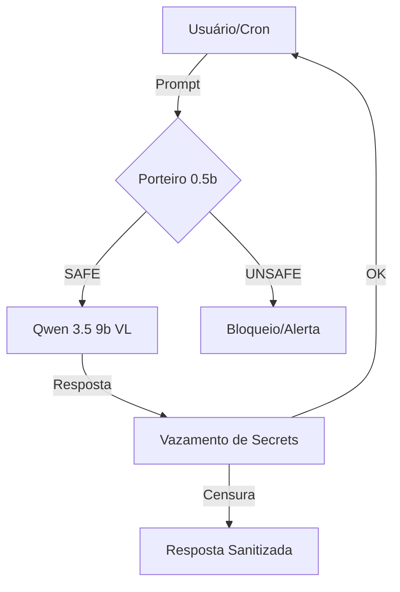

# Porteiro: O Sentinela de Segurança (SOTA 2026.1)

O **Porteiro** é a camada de governança e segurança de entrada/saída (Input/Output Guardrails) do ecossistema Aurélia. Projetado para soberania total, ele utiliza o modelo ultraleve **Qwen 2.5 0.5b** para garantir latência mínima e proteção máxima contra injeção de prompts e vazamento de segredos.

## Arquitetura

O Porteiro opera como um middleware entre o usuário (ou sistema) e o LLM primário (Qwen 3.5 9b VL).



## Componentes

### 1. Input Guardrail (Análise Semântica)
- **Modelo**: `qwen2.5:0.5b`
- **Funcionalidade**: Analisa se o prompt contém tentativas de "ignore previous instructions", "jailbreak" ou técnicas de injeção.
- **Cache**: Utiliza Redis com hash SHA-256 para evitar re-análise de prompts idênticos por 30 dias.
- **Whitelist**: Saudações curtas e comandos de teste são liberados via código para latência zero.

### 2. Output Guardrail (Secret Scanner)
- **Funcionalidade**: Varredura rápida de strings para detectar vazamento de chaves (OpenAI, GitHub, Telegram, Aurelia).
- **Ação**: Se um segredo é detectado, a saída é automaticamente substituída por um aviso de bloqueio de segurança.

## Configuração Industrial

O Porteiro é inicializado no `cmd/aurelia/app.go` com um de seus próprios providers dedicados:

```go
// Exemplo de inicialização
p := llm.NewOllamaProvider(a.cfg.OllamaURL, "qwen2.5:0.5b")
a.porteiro = middleware.NewPorteiroMiddleware(a.redis, p)
```

## Proteção Contra Breakage

- **Fail-Open**: Em caso de falha no modelo `0.5b`, o Porteiro permite a passagem (Fail-Open) para evitar interrupção de serviço, mas loga o erro como crítico.
- **Soberania**: 100% da análise é local (Ollama), sem envio de dados para APIs externas durante a triagem de segurança.
- **Pruning-Safe**: Este modelo é explicitamente mantido na whitelist de VRAM (junto com Emblend, Kodoro e Qwen 3.5).

## Manual de Operação (SOTA 2026.2)

### Níveis de Rigor (PORTEIRO_MODE)
O comportamento do Sentinela pode ser ajustado via variável de ambiente no `.env`:
- **STRICT** (Padrão): Bloqueia ativamente ameaças detectadas.
- **LOG_ONLY**: Monitora e loga ataques sem bloquear (ideal para desenvolvimento).
- **OFF**: Ignora completamente a camada de segurança (latência zero).

### Gestão Industrial (porteiro-ops)
Para gerenciar o cache do Redis e ajustar o Sentinela em tempo real, utilize a skill:
- **[porteiro-ops](file:///.agent/skills/porteiro-ops/SKILL.md)**

---
*Documentação Atualizada via SOTA 2026.2 Industrial Workflow.*
