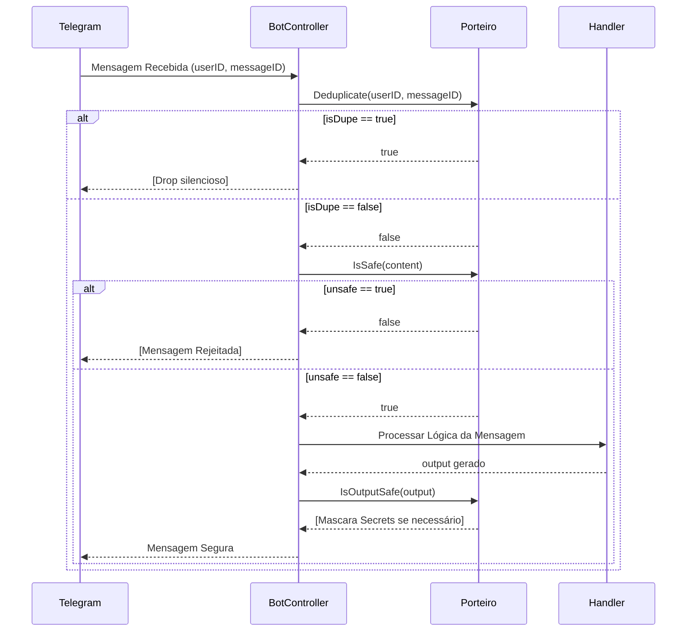

# Porteiro Middleware: Refatoração de Arquitetura (31/03/2026)

## Visão Geral
Porteiro é o middleware de segurança de input/output da Aurélia. Sua função primária é proteger a aplicação contra tentativas de *prompt injection*, deduplicar mensagens recebidas do Telegram para evitar processamento redundante e mascarar ativamente *secrets* ou tokens sensíveis no output gerado pela IA, garantindo a integridade e privacidade do ecossistema.

## Arquitetura Antes vs Depois

| Aspecto | Antes (Redis + Qwen) | Depois (In-Memory) |
| --- | --- | --- |
| **Dependências** | Redis (para bloqueio distribuído), LiteLLM/Qwen 0.5b (para análise de injeção e polimento) | Nenhuma (Go nativo apenas) |
| **Latência Estimada** | ~800ms adicionais por mensagem | < 1ms por mensagem (hot path síncrono in-memory) |
| **Comportamento em Falha** | *Fail-open*: se o Redis caísse, todas as mensagens eram processadas (isDupe = false) | Deterministíco: processamento restrito à capacidade de CPU da instância atual |
| **Persistência do Dedup** | Persistente no disco (via Redis), sobrevivendo a reinicializações da aplicação | Efêmero (in-memory): limpeza de estado a cada restart do processo da Aurélia |

## Fluxo de uma Mensagem



## Anatomia do Código Atual

### Slice A — Struct e construtor:
```go
// dupeEntry armazena o tempo limite para a expiração do lock de uma mensagem.
// Utilizado p/ limpeza assíncrona da hash table a fim de prevenir OOM (Out Of Memory).
type dupeEntry struct {
    expiresAt time.Time
}

// PorteiroMiddleware engloba o state da deduplicação e a configuração de guardrails.
type PorteiroMiddleware struct {
    mu             sync.Mutex               // Protege mutações no mapa 'seen'
    seen           map[string]dupeEntry     // Armazena 'userID:messageID' como chave
    mode           string                   // Define severidade (STRICT, LOG_ONLY, OFF)
    secretPatterns map[string]string        // Regex baseados nas chaves a proteger
}

// NewPorteiroMiddleware inicializa as rotinas de limpeza e configura as expressões regulares.
func NewPorteiroMiddleware() *PorteiroMiddleware {
    mode := strings.ToUpper(os.Getenv("PORTEIRO_MODE"))
    if mode == "" {
        mode = "LOG_ONLY" // Modo não-bloqueante por padrão
    }
    p := &PorteiroMiddleware{
        seen: make(map[string]dupeEntry),
        mode: mode,
        secretPatterns: map[string]string{
            "OpenAI":   `sk-[a-zA-Z0-9]{32,}`,
            "GitHub":   `gh[p|o|r|s|b|e]_[a-zA-Z0-9]{36,}`,
            "Telegram": `[0-9]{8,10}:[a-zA-Z0-9_-]{35}`,
        },
    }
    go p.cleanup() // Worker background para expurgo de chaves expiradas
    return p
}
```

### Slice B — Deduplicate in-memory:
```go
// Deduplicate avalia se a combinação de User e Message foi recém-processada,
// devolvendo false se a mensagem for nova, e true se já foi vista no TTL estabelecido.
func (p *PorteiroMiddleware) Deduplicate(_ context.Context, userID, messageID string) (bool, error) {
    if os.Getenv("PORTEIRO_DEDUPLICATE") == "OFF" || messageID == "" {
        return false, nil // Bypass para ambiente de testes ou ID inválido
    }
    key := userID + ":" + messageID
    now := time.Now()
    
    // Trava de Mutex obrigatória para ler e modificar o mapa in-memory paralelamente
    p.mu.Lock()
    defer p.mu.Unlock()
    
    entry, exists := p.seen[key]
    if exists && now.Before(entry.expiresAt) {
        return true, nil // Duplicata identificada no intervalo ativo
    }
    
    // Registo ou atualização de nova mensagem com TTL fixado de 15 segundos
    p.seen[key] = dupeEntry{expiresAt: now.Add(15 * time.Second)}
    return false, nil
}
```

### Slice C — Cleanup goroutine:
```go
// cleanup executa a varredura e expurgo periódico de keys expiradas.
// Evita o vazamento de memória com alta carga prolongada de mensagens.
func (p *PorteiroMiddleware) cleanup() {
    ticker := time.NewTicker(60 * time.Second) // Frequência de limpeza a cada 60s
    defer ticker.Stop()
    for range ticker.C {
        now := time.Now()
        p.mu.Lock()
        for k, v := range p.seen {
            // Se o limite expirou, limpa efetivamente a referência de memória
            if now.After(v.expiresAt) {
                delete(p.seen, k)
            }
        }
        p.mu.Unlock()
    }
}
```

## Variáveis de Ambiente

| Variável | Valores Suportados | Padronização (Default) | Descrição |
| --- | --- | --- | --- |
| `PORTEIRO_MODE` | `STRICT`, `LOG_ONLY`, `OFF` | `LOG_ONLY` | Define o rigor no bloqueio de *prompt injections*. `STRICT` barra a mensagem na fronteira. |
| `PORTEIRO_DEDUPLICATE` | `ON`, `OFF` | (ativo por padrão) | Ativa ou desativa a política de restrição de mensagens repetidas e retries momentâneos do lado do cliente. |

## Comportamento em Falha

| Cenário | Comportamento Restrito | Impacto no Usuário |
| --- | --- | --- |
| **Processo restart (crash do binário)** | O mapa in-memory é recriado vazio do zero. | O bot pode receber e processar novamente uma notificação push antiga do Telegram logo no reinício (*replay* momentâneo). |
| **Alta Carga (>1000 msg/s)** | Bloqueio de Lock (`sync.Mutex`) aumenta a utilização da CPU via travamento de threads em leituras/escritas. | Possivelmente um levíssimo process delay sub-milisegundo para responder à mesma janela de 15s; latência desapercebida pelo cliente real. |
| **Injection detectada em `LOG_ONLY`** | O payload é apenas logado no stdout/APM, mas segue fluindo para o LLM. | O usuário percebe seu input restrito sendo consumido e processado livremente pela IA. Ação documentada, mas autorizada. |
| **Injection detectada em `STRICT`** | O `IsSafe()` barra o envio do request para o Core Handler, rejeitando na ponta. | O usuário receberá uma mensagem sinalizando recusa/barramento de política, impossibilitando tentativas de *jailbreak*. |

## Tech Debt Registrado

1. **Multi-instância sem dedup sincronizado:** O modelo recém-instaurado através de memória RAM estrita (`sync.Map`) é stateful e instancial. Se o bot for servido em N instâncias futuras, duplicatas cairão sem que ocorra deduplicação nativa transparente através de um cache global stateful.
2. **Polish de Output removido:** Apesar de performar extremamente rápido sem o auxílio do Qwen 0.5b removendo a latência atritada, outputs brutos correm risco de semântica prejudicada frente a injeções de contexto do core, sem que a saída do chatbot sofra um re-processamento inteligente (necessário opcional via Interface posteriormente).
3. **Cache de IsSafe sem persistência:** Respostas e preceitos regulares cacheadas sobre a confiabilidade do `IsSafe` ou perfis nocivos apagam imediatamente ao reset da instância.

## Como Testar

```go
func TestPorteiro_Deduplicate(t *testing.T) {
    p := NewPorteiroMiddleware()
    ctx := context.Background()

    // 1. O primeiro envio deve passar
    isDupe, _ := p.Deduplicate(ctx, "user123", "msg001")
    if isDupe {
        t.Errorf("Esperado false, obteve true no primeiro envio")
    }

    // 2. Envio quase imediato (mesmo userID e messageID em < 15s) deve ser barrado como dupe
    isDupe, _ = p.Deduplicate(ctx, "user123", "msg001")
    if !isDupe {
        t.Errorf("Esperado true, obteve false no de-dup interval")
    }

    // 3. messageID vazio não faz bloqueio -> isDupe = false
    isDupe, _ = p.Deduplicate(ctx, "user123", "")
    if isDupe {
        t.Errorf("Esperado false (bypass em message IDs em branco), obteve true")
    }
}
```
